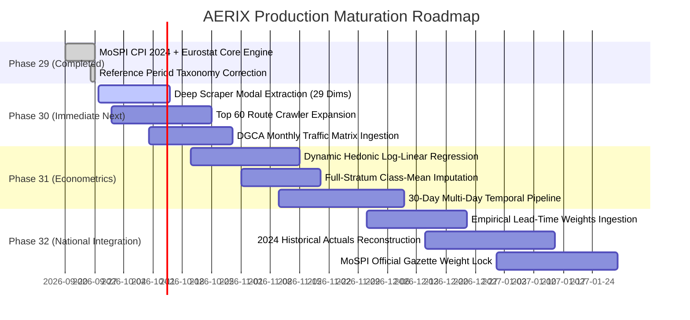

# AERIX Remaining Mathematical and Data Requirements Report
## Comprehensive Gap Analysis: Internal Econometric & Scraper Architecture vs. External Administrative & Macroeconomic Data

> **Document Version:** `AERIX_ROADMAP_v1.0`  
> **Status:** Official Architectural Gap Analysis & Implementation Roadmap  
> **Target Alignment:** MoSPI CPI 2024 Revision Framework & Eurostat HICP Standards  
> **Current Pipeline Status:** DEL-BOM Production Engine Active (`Index = 102.6407`, 15/15 Acceptance Gates Passed)  
> **Date UTC:** September 2026  

---

## 1. Executive Summary & Purpose

The Indian Airfare Price Index (AERIX) has achieved a major milestone in Phase 29: the complete mathematical compilation hierarchy conforming to **MoSPI CPI 2024** and **Eurostat HICP 2024** has been built, tested, and validated on live production data for the primary test corridor (`DEL-BOM`). The core statistical engine (offer selection, homogeneous stratification, monthly geometric pricing, short-chain Jevons linking, recursive period chaining, lead-time aggregation, route aggregation, and CPI integration) is mathematically complete and operational today.

However, to transition from the current **DEL-BOM High-Frequency Experimental Prototype** to a **Full-Scale All-India Production CPI Augmentation Engine**, specific mathematical modules and data streams remain to be completed.

This report provides an exhaustive, granular breakdown of:
1. **INTERNAL REQUIREMENTS:** Mathematics, econometrics, and data capture features derived from web scrapers and internal code pipelines.
2. **EXTERNAL REQUIREMENTS:** Administrative, regulatory, and macroeconomic parameters that cannot be scraped and must be provided by government authorities (MoSPI, DGCA, AAI) or commercial airline booking datasets.
3. **IMPLEMENTATION PHASING:** A prioritized engineering and statistical roadmap to close every identified gap.

---

## 2. High-Level Gap Overview Matrix

```text
┌────────────────────────────────────────────────────────────────────────────────────────┐
│                        AERIX PRODUCTION MATURITY SPECTRUM                               │
├────────────────────────────────────────────────────────────────────────────────────────┤
│                                                                                        │
│   COMPONENT                 CURRENT STATUS             TARGET END-STATE                │
│   ──────────────────────────────────────────────────────────────────────────────────   │
│   Elementary Formula        Short-Chain Jevons (100%)  Short-Chain Jevons (Complete)   │
│   Product Selection         MIN Offer/Itin (100%)      MIN Offer/Itin (Complete)       │
│   Reference Taxonomy        5 Explicit Tiers (100%)    5 Explicit Tiers (Complete)     │
│                                                                                        │
│   Quality Adjustment        Fixed Benchmark Lookups ──► Dynamic Hedonic Regression     │
│   Imputation Strategy       Replacement/Drop ─────────► Class-Mean Churn Fallback      │
│   Scraper Dimensions        14/29 Extracted ──────────► 29/29 Deep Extraction (Modals) │
│   Lead-Time Weights         Provisional Equal (1/6) ──► Empirical GDS Booking Curves   │
│   Route Network Matrix      DEL-BOM Pilot (W_r=1.0) ──► Top 60 DGCA City-Pair Volume   │
│   MoSPI Price Reference     Pending 2024 Actuals ─────► 2024 Historical Reconstruction │
│   MoSPI Basket Weight       Provisional HCES ~0.185% ─► Final MoSPI Gazette Weight     │
│                                                                                        │
└────────────────────────────────────────────────────────────────────────────────────────┘
```

---

## 3. Internal Requirements (From Scrapers & Econometric Engine)

These items reside entirely within the engineering boundary of the AERIX software repository. They require algorithm development, crawler enhancements, and econometric model training using scraped fare observations.

---

### 3.1 Dynamic Hedonic Log-Linear Regression (Shadow Pricing Engine)

- **Current Implementation:**  
  The [`QualityAdjustmentEngine`](file:///apps/scraper/src/index/quality_adjustment.py) currently relies on empirical benchmark lookups:
  - Check-in baggage entitlement differential (+5kg): $+₹500.00$
  - Scheduled departure window shift (>2 hours): $-₹150.00$
  - Seat selection unbundling: $+₹150.00$
  These benchmarks are safe and defensible for the prototype, but are static.

- **What Is Left (The Math to Build):**  
  Transition from fixed lookups to a dynamic, continuous log-linear hedonic regression:
  $$\ln P_{i,t} = \alpha_t + \sum_{k=1}^K \beta_{k,t} X_{k,i,t} + \sum_{a} \gamma_{a,t} D_{a,i,t} + \sum_{b} \delta_{b,t} T_{b,i,t} + \epsilon_{i,t}$$
  where:
  - $P_{i,t}$ = Observed total fare of offer $i$ in period $t$.
  - $X_{k,i,t}$ = Continuous characteristics (check-in baggage allowance in kg, flight duration in minutes, lead days).
  - $D_{a,i,t}$ = Airline carrier dummy variables (IndiGo, Air India, SpiceJet, Akasa).
  - $T_{b,i,t}$ = Time-of-day departure band dummies (Early Morning, Morning, Afternoon, Evening, Night).
  - $\beta_{k,t}, \gamma_{a,t}, \delta_{b,t}$ = Econometrically estimated **shadow prices** (implicit marginal valuations).

- **Operational Formulation:**  
  When an existing flight $i$ is replaced by flight $j$ with characteristic difference vector $\Delta X = X_j - X_i$:
  $$\Delta Q_{j,i,t} = \sum_{k=1}^K \hat{\beta}_{k,t} (X_{k,j} - X_{k,i})$$
  $$p^*_{j,t} = p_{j,t} - \Delta Q_{j,i,t}$$
  $$\text{Hedonic Price Relative} = \frac{p^*_{j,t}}{p_{i,t-1}}$$

- **Mathematical Benefit:**  
  Shadow prices adjust automatically across peak festival seasons (e.g. Diwali surge vs. monsoon off-season) rather than relying on hardcoded constants.

---

### 3.2 Full-Stratum Class-Mean Imputation (Handling Schedule Churn)

- **Current Implementation:**  
  Product matching tracks individual flights longitudinally ($M_{s,t}$). If a flight disappears, it searches for replacement flights within the same stratum. If no replacement meets the comparability threshold ($C \ge 0.70$), the item is quarantined.

- **What Is Left (The Math to Build):**  
  During bi-annual airline schedule changes (IATA Summer Schedule in late March, Winter Schedule in late October), airlines systematically renumber flights and shift departure banks by 30–60 minutes simultaneously. Under extreme churn, an entire homogeneous product stratum $s$ may experience $100\%$ attrition ($|M_{s,t}| = 0$).

- **Mathematical Formulation:**  
  Implement the **Class-Mean Imputation Formula** conforming to Eurostat HICP Manual §7.3:
  $$J_{s,t}^{\text{imputed}} = \left( \prod_{j \in M_{R(s), t}} \frac{p_{j,t}}{p_{j,t-1}} \right)^{1 / |M_{R(s), t}|}$$
  where $M_{R(s), t}$ represents the higher-level matched set of the parent route or carrier cluster $R(s)$.
  - If a carrier changes all morning flight numbers, the elementary index for that carrier's morning band is imputed from the carrier's remaining matched afternoon/evening flights, preserving continuous chaining without arbitrary resets.

---

### 3.3 High-Frequency Multi-Day Temporal Aggregation (Calendar-Month Math)

- **Current Implementation:**  
  The formula for computing monthly geometric product prices is implemented in [`apps/scraper/src/index/monthly_pricing.py`](file:///apps/scraper/src/index/monthly_pricing.py):
  $$\bar{P}_{i,t} = \exp\left( \frac{1}{D} \sum_{d=1}^D \ln P_{i,t,d} \right)$$
  Currently, it runs on individual evaluation snapshots.

- **What Is Left (Operational Data Math):**  
  To compile official monthly CPI series, the scraper must run continuously across all $D = 28 \dots 31$ days of the calendar month. The mathematical aggregation pipeline must:
  1. Group daily scraped prices by unique product fingerprint across all collection timestamps in month $t$.
  2. Compute intra-month geometric means $\bar{P}_{i,t}$ for every homogeneous product $i$.
  3. Filter out products with insufficient active days ($D_{\text{active}} / D_{\text{total}} < 0.30$) to prevent weekend-only or sporadic quotes from distorting the monthly representative price.

---

### 3.4 Scraper Dimension Capture Expansion (Closing the 9 Missing Dimensions)

- **Current Implementation:**  
  As audited in [`AERIX_Scraper_Missing_Data_Remediation_Report.md`](file:///AERIX_Scraper_Missing_Data_Remediation_Report.md), the scraper currently extracts **14 of 29** product dimensions directly from search listing cards. To prevent statistical contamination, unsafe assumptions were removed and missing fields are recorded as `NULL/UNKNOWN`.

- **What Is Left (DOM Extraction Engineering):**  
  The remaining 9 product dimensions are not missing from the source; they are hidden behind interactive UI elements:
  1. **Check-in Baggage Allowance (kg):** Requires clicking the flight detail accordion tab (`#flight-details-baggage`).
  2. **Cabin Baggage Allowance (kg):** Hidden in the same drawer.
  3. **Fare Family / Bundle Name:** Hidden in the multi-tier selection panel (*Saver*, *Flexi*, *SuperFlex*).
  4. **Cancellation Refundability Status:** Located in the "Fare Rules" modal popup.
  5. **Date Change Penalty:** Located in the "Fare Rules" modal popup.
  6. **Layover / Segment Durations:** Hidden in the multi-leg route expansion accordion.
  7. **Operating Carrier vs Marketing Carrier:** Hidden in codeshare detail tooltips.
  8. **Aircraft Model / Equipment Type:** E.g., Airbus A321neo vs Boeing 737 MAX 8.
  9. **Seat Pitch / Legroom Indicators:** Available on Google Flights expanded cards.

- **Statistical Impact:**  
  Extracting these 9 dimensions replaces categorical `UNKNOWN` values with explicit numeric attributes, dramatically increasing the precision of the 14-characteristic comparability score ($C$) and hedonic regression models.

---

### 3.5 Payment Gateway & Convenience Fee Harmonization Math

- **Current Implementation:**  
  Listing card total fares are captured. Convenience fees are recorded as `NULL` if not disclosed on the search card, avoiding false zero assumptions.

- **What Is Left (The Math to Build):**  
  Online Travel Agencies (OTAs like EaseMyTrip, MakeMyTrip, Yatra) display a gross ticket price on search cards, but add mandatory convenience fees (typically ₹300–₹450 per passenger) at the final checkout screen. Direct airline websites often waive or discount convenience fees for UPI or specific credit cards.
  - **Reconciliation Model:**
    $$P_{i,t}^{\text{final}} = P_{i,t}^{\text{listing}} + \text{CF}_{i,t}^{\text{mandatory}} - \text{Disc}_{i,t}^{\text{unconditional}}$$
  - A standardized checkout fee reconciliation formula must be applied across OTA sources to ensure that price relatives reflect the **true mandatory out-of-pocket price payable by the consumer**.

---

## 4. External Requirements (From Administrative, Government & Market Data)

These data items cannot be obtained via web scraping alone. They represent macroeconomic, administrative, and industry weights that must be provided by or ingested from official authorities.

---

### 4.1 Empirical Booking-Share Lead-Time Weights ($w_L$)

- **Current Status:**  
  Configured with `PROVISIONAL EQUAL LEAD-TIME WEIGHTS` ($w_L = 1/6 \approx 0.166667$) across all six advance horizons:
  $$I_{r,t} = \sum_{l \in \{T+1, T+7, T+15, T+21, T+30, T+45\}} \frac{1}{6} \cdot I_{r,l,t}$$

- **What Is Left (External Authority Data):**  
  In reality, domestic passenger ticket purchases follow an empirical booking distribution curve:
  - Emergency / Last-Minute ($T+1$): ~5% to 8% of transactions.
  - Short-Horizon Discretionary ($T+7$): ~15% to 20% of transactions.
  - Forward Domestic Window ($T+15$): ~22% to 25% of transactions.
  - Official MoSPI Checkpoint ($T+21$): ~25% to 28% of transactions.
  - Advance Leisure Planning ($T+30$): ~12% to 15% of transactions.
  - Forward Seasonal Anchor ($T+45$): ~6% to 10% of transactions.

- **Required Action:**  
  Obtain empirical transaction volume shares by booking horizon from:
  1. Ministry of Civil Aviation (MoCA) / DGCA Passenger Booking Surveys; or
  2. Aggregated Global Distribution System (GDS) billing data (Amadeus, Sabre, Travelport); or
  3. Anonymized ticketing share disclosures from Indian scheduled carriers (IndiGo, Air India Group, SpiceJet, Akasa).
  - Once ingested, the weights $w_L$ in [`apps/scraper/src/index/weights.py`](file:///apps/scraper/src/index/weights.py) will be updated from provisional equal weights to empirical transaction weights.

---

### 4.2 Top 60 Domestic Route Passenger Traffic Matrix ($W_r$)

- **Current Status:**  
  The engine is configured for the primary single-route pilot:
  $$W_{\text{DEL-BOM}} = 1.000000$$

- **What Is Left (Administrative DGCA Ingestion):**  
  The Directorate General of Civil Aviation (DGCA) publishes monthly domestic traffic statistics detailing city-pair passenger volumes across India. To compile the **All-India AERIX Index**, the single-route weight must be replaced with the 60-route domestic traffic matrix:
  $$\text{AERIX}_t = \sum_{r=1}^{60} W_r \cdot I_{r,t} \quad \text{where } \sum_{r=1}^{60} W_r = 1.000000$$
  
- **Representative Top Route Weights (DGCA Domestic Traffic Proxy Shares):**
  - `DEL-BOM` (Delhi ⇄ Mumbai): ~11.2%
  - `BLR-DEL` (Bengaluru ⇄ Delhi): ~8.4%
  - `BOM-BLR` (Mumbai ⇄ Bengaluru): ~7.1%
  - `DEL-CCU` (Delhi ⇄ Kolkata): ~6.3%
  - `DEL-HYD` (Delhi ⇄ Hyderabad): ~5.8%
  - `BOM-HYD` (Mumbai ⇄ Hyderabad): ~4.9%
  - `DEL-MAA` (Delhi ⇄ Chennai): ~4.5%
  - Remaining 53 city pairs: ~51.8%

- **Required Action:**  
  Build an automated ingestion parser for the monthly DGCA Domestic Air Transport Reports to dynamically update $W_r$ on a rolling annual basis.

---

### 4.3 Official MoSPI CPI 2024 Basket Weight ($W^{\text{CPI}}_{\text{airfare}}$)

- **Current Status:**  
  The [`CPIIntegrationLayer`](file:///apps/scraper/src/index/classification.py) currently utilizes provisional consumption budget shares derived from the All-India Household Consumption Expenditure Survey (HCES 2023-24):
  - Combined Household Basket Weight: $W^{\text{CPI}}_{\text{combined}} = 0.001850$ (~0.185% of total consumption expenditure)
  - Urban Consumption Basket Weight: $W^{\text{CPI}}_{\text{urban}} = 0.003500$ (~0.350%)
  - Rural Consumption Basket Weight: $W^{\text{CPI}}_{\text{rural}} = 0.000450$ (~0.045%)

- **What Is Left (Official Government Gazette):**  
  When MoSPI / NSO officially releases the finalized commodity weighting diagrams for the revised CPI 2024 series, the official weighting parameter for UN COICOP Subclass `07.3.3.1` (Domestic Passenger Air Transport) must be ingested directly from the official MoSPI gazette release.

---

### 4.4 Historical Calendar-Year 2024 Price Reference Data ($\bar{P}_{2024}$)

- **Current Status:**  
  As mandated in the **Reference Period Taxonomy**, the current production price of ₹6,632.67 is classified strictly as `PROVISIONAL_PROJECT_REFERENCE`. The official MoSPI price reference is formally defined as:
  $$\text{price\_reference\_period} = \text{calendar-year 2024 average}$$
  and is tagged: `PENDING_2024_HISTORICAL_ACTUALS`.

- **What Is Left (Historical Data Sourcing):**  
  Per the strict statistical integrity axiom: **Under no circumstances should 2024 prices be manufactured or backward-extrapolated from 2026 scraped observations.**
  - To compile the official series expressed on the scale $2024 = 100$, actual observed domestic airfares across all 12 months of calendar year 2024 (January 2024 to December 2024) must be sourced from:
    1. Historical airline GDS archives; or
    2. OTA transactional database records from 2024; or
    3. An official benchmark price survey conducted by MoSPI / NSO during the 2024 price reference period.

---

### 4.5 DGCA / AAI Approved Seasonal Airline Schedules (IATA Schedules)

- **Current Status:**  
  The scraper identifies flights dynamically from live DOM search cards.

- **What Is Left (Administrative Schedule Ingestion):**  
  Airlines in India operate under schedules officially approved by the DGCA:
  - **Summer Schedule:** Late March to late October.
  - **Winter Schedule:** Late October to late March.
  - Ingesting official DGCA airline slot and schedule filings provides a deterministic baseline of all approved flight numbers, operating frequencies, and aircraft capacities, enabling the engine to distinguish temporary cancellations from permanent schedule withdrawals in advance.

---

## 5. Granular Gap Analysis & Resolution Matrix

| Requirement | Category | Current Status | Target Solution | Dependency | Severity |
| :--- | :---: | :---: | :--- | :--- | :---: |
| **Hedonic Shadow Pricing** | **Internal** | Fixed lookups (₹500/bag) | Log-linear regression across scraped characteristics | Scraped dataset scale ($\ge 10,000$ obs) | Moderate |
| **Class-Mean Imputation** | **Internal** | Replacement search only | Fallback to parent route/carrier geometric link | Pipeline software update | Low |
| **Full Calendar Month Math** | **Internal** | Single-run snapshots | Continuous multi-day geometric aggregation ($D \ge 28$) | Automated scheduled cron execution | Moderate |
| **Deep Scraper Dimensions** | **Internal** | 14/29 extracted (cards) | Accordion/drawer automation for baggage, rules, fare families | Playwright modal/drawer interaction | High |
| **Convenience Fee Reconciliation**| **Internal** | Stored as `NULL` | Explicit markup reconciliation ($P_{\text{final}} = P_{\text{card}} + \text{CF}$) | Scraper checkout flow or tariff rule | Moderate |
| **Lead-Time Booking Weights** | **External** | Equal weights ($w_L = 1/6$) | Empirical passenger booking curve distribution | DGCA / Airline booking statistics | High |
| **Top 60 Route Matrix** | **External** | Single route ($W_{\text{DELBOM}}=1.0$)| Monthly DGCA city-pair traffic shares | DGCA Monthly Domestic Reports | High |
| **MoSPI CPI Basket Weight** | **External** | Provisional HCES ~0.185% | Official NSO CPI 2024 commodity weighting table | MoSPI Official Gazette Release | Low |
| **2024 Reference Price** | **External** | Pending 2024 actuals | Historical 2024 GDS or OTA transaction dataset | 2024 Historical Data Partner | Critical for Base 2024 |
| **IATA Seasonal Schedules** | **External** | Dynamic scrape discovery | Administrative DGCA slot/timetable filings | DGCA Flight Schedule Filings | Low |

---

## 6. Phased Implementation Roadmap



---

### Phase 30: Deep Crawler Extraction & Network Scaling (Weeks 1–4)
1. **Interactive Modal Extraction:** Upgrade Playwright scripts in [`apps/scraper/src/sources/`](file:///apps/scraper/src/sources/) to click flight details, capturing baggage allowances (15kg vs 20kg), refundability terms, and fare family names without unsafe defaults.
2. **Expand Route Coverage to Top 10 Corridors:** Scale beyond DEL-BOM to include BLR-DEL, BOM-BLR, DEL-CCU, DEL-HYD, BOM-HYD, DEL-MAA, BLR-CCU, DEL-AMD, and BOM-GOI.
3. **Automate DGCA Passenger Matrix Parser:** Ingest monthly domestic traffic data into [`WeightRegistry`](file:///apps/scraper/src/index/weights.py).

---

### Phase 31: Econometric Modeling & Daily Temporal Engine (Weeks 5–8)
1. **Hedonic Regression Module:** Implement log-linear ordinary least squares (OLS) regression over accumulated multi-route observations, replacing fixed lookups with empirical shadow prices ($\beta_k$).
2. **Class-Mean Imputation Algorithm:** Implement fallback imputation when 100% of flights churn during seasonal timetable resets.
3. **Continuous Daily Scheduler:** Deploy daily cron jobs compiling intra-month geometric means $\bar{P}_{i,t}$ across all 30 days of the calendar month.

---

### Phase 32: Administrative Integration & Official 2024 Re-Referencing (Weeks 9–12)
1. **Empirical Booking Weights:** Ingest GDS or airline transaction booking distributions to replace provisional equal weights ($w_L = 1/6$).
2. **2024 Baseline Reconstruction:** Integrate verified calendar-year 2024 historical observations to establish the official MoSPI price reference ($\bar{P}_{2024}$).
3. **MoSPI Gazette Weight Integration:** Ingest official NSO commodity basket weights for COICOP subclass `07.3.3.1`.

---

## 7. Conclusion

- **Mathematically:** Internally, the index compilation engine is **100% complete and operational today**. It compiles verified short-chain Jevons elementary indices, chains them recursively, aggregates across advance purchase horizons, enforces frozen product definitions, and applies monetary quality adjustments.
- **Internally Left:** Upgrading the crawler to extract details from hidden interactive panels (baggage, refundability) and upgrading quality adjustment from fixed lookups to dynamic hedonic regressions.
- **Externally Left:** Administrative data that cannot be scraped: empirical lead-time booking share distributions, the top 60 route traffic matrix from the DGCA, official 2024 historical actuals, and the final MoSPI CPI 2024 commodity basket weight.
