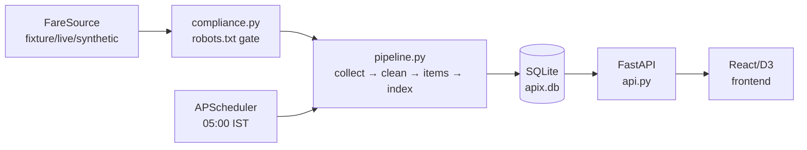

# APIx – Airfare Price Index

A prototype pipeline that computes a **chained Laspeyres-style price index for Indian domestic airfares**, following the methodology used in India's CPI 2024 (Jevons at the elementary level, Young-type aggregation above).

> **Prototype status.** All live sources are disabled; the system runs on fixture and synthetic data. See `SOURCES.md` for compliance details.

---

## What it does

1. Every day at **05:00 IST**, collect fares for 3 routes (DEL-BOM, DEL-BLR, BOM-BLR) across 4 advance-purchase windows (1, 7, 15, 30 days).
2. Clean the quotes and store raw responses alongside every parsed quote.
3. Compute a chained price index.
4. Serve results through a REST API.
5. Show them in a designed React/D3 web frontend.

---

## Quick start

```bash
# Install dependencies
pip install -e "apix/[dev]"

# Seed 60 days of synthetic history
make seed

# Run one collection cycle (uses fixture source by default)
make run-once

# Start the API server
make api

# Start the web frontend (separate terminal)
make web

# Run all tests
make test
```

---

## Schedule

APScheduler runs a `CronTrigger(hour=5, minute=0, timezone="Asia/Kolkata")` inside the API process.

**Plain-cron alternative:**
```cron
0 5 * * *   TZ=Asia/Kolkata python apix/scripts/run_once.py
```

Note: `05:00 IST` = `23:30 UTC` the previous calendar day.

If the machine is asleep at 05:00, the run is **missed**. On startup, the scheduler checks whether today's run is missing and runs it once as a catch-up. This does **not** cover multiple consecutive missed days.

If using GitHub Actions (hosted runners): be aware that datacenter IPs are more likely to be blocked by travel sites. Always prefer local or on-prem execution.

---

## Method

### Items
An **item** is a fixed specification: `(route, lead_days, dep_band)`. With 3 routes, 4 lead windows, and 3 departure bands, there are 36 possible items per day.

### Item price
The `min` (default) of `total_fare` over eligible economy nonstop quotes in that item's cell on a given observation date.

### Relative
`P_t / P_prev`, where `prev` is the previous date on which the item had a price.

### Aggregation

```
band_relative       = geometric mean of item relatives in the band (Jevons)
lead_time_relative  = weighted geometric mean of band relatives (lead_day weights)
route_relative      = weighted geometric mean of lead-time relatives (lead_day weights)
overall_relative    = weighted arithmetic mean of route relatives (route weights)
Index_t             = Index_{t-1} × OverallRelative_t    (base 100)
```

Missing items in a day → renormalise remaining weights. Coverage = share of expected items that produced a relative. If coverage < 0.5, no level is published.

### Weights
- **Route weights** are placeholders (DEL-BOM 0.50, DEL-BLR 0.30, BOM-BLR 0.20). Replace with DGCA city-pair passenger shares when available.
- **Lead-time weights** are equal-weight assumptions (0.25 each). The frontend weights panel lets you test sensitivity.

---

## Architecture



---

## Limitations

- The index measures **displayed fares** for a fixed set of items. It is **not** what travellers actually paid (no booking data).
- Route weights are placeholders until replaced with shares from DGCA city-pair data.
- Lead-time weights are assumptions; the UI weights panel shows sensitivity.
- A short real history cannot be compared meaningfully with official monthly series.
- One source only. A production system would use data-sharing agreements or official fare feeds, not scraping.
- Day-over-day relatives include weekday effects because the departure date moves each day.
- If the machine sleeps at 05:00 IST, runs are missed. Startup catch-up covers one missed day.
