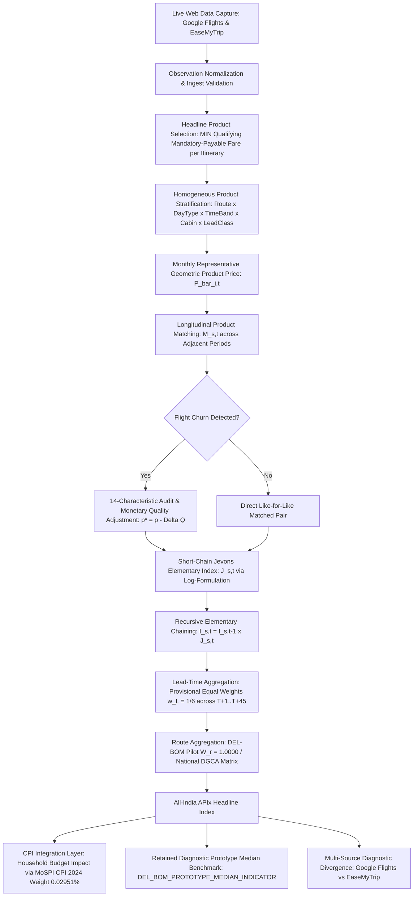

# India Airfare Price Index (APIx) — SIH 2026

[](https://www.python.org/)
[](https://fastapi.tiangolo.com/)
[](https://vitejs.dev/)
[](https://crawlee.dev/)
[](https://www.mospi.gov.in/)
[](https://ec.europa.eu/eurostat/)
[](file:///tests/core/test_phase29_mospi_eurostat_engine.py)

Welcome to the **Indian Airfare Price Index (APIx)** repository! APIx is an enterprise-grade, high-frequency airfare price collection and index compilation engine engineered for scheduled domestic commercial aviation in India.

The platform aligns web-scraped airline ticket prices with official national and international statistical compilation standards:
- **MoSPI CPI 2024 Revision Framework:** Conceptual base $2024 = 100$, UN COICOP 2018 Subclass `07.3.3.1` (Domestic Passenger Transport by Air), $T+21$ official domestic advance-booking checkpoint, unweighted short-chain Jevons elementary index, and Household Consumption Expenditure Survey (HCES 2023-24) weighting integration.
- **Eurostat HICP 2024 Standards:** Web scraping practical guidelines, product-offer level observation tracking, frozen headline product definition (lowest qualifying mandatory-payable adult economy fare per itinerary), 14-characteristic replacement and quality adjustment framework, strict non-zero treatment for unavailable fares, and non-weighting of scraper row counts.

> [!IMPORTANT]
> **Institutional Scope Note:**  
> APIx is an experimental airfare price index engineered for research, macroeconomic transparency, and potential Consumer Price Index (CPI) augmentation. It is **not** an official publication of MoSPI / NSO or the Government of India.

---

## 📑 Table of Contents

1. [System Architecture & Compilation Hierarchy](#-system-architecture--compilation-hierarchy)
2. [Reference Period Taxonomy (MoSPI vs Eurostat vs Project Reference)](#-reference-period-taxonomy)
3. [Key Methodological & Econometric Foundations](#-key-methodological--econometric-foundations)
4. [Advance-Purchase Architecture & Weighting System](#-advance-purchase-architecture--weighting-system)
5. [Repository Structure](#-repository-structure)
6. [Quick Start & Installation](#-quick-start--installation)
7. [Running the Index Compilation Engine](#-running-the-index-compilation-engine)
8. [Production REST API Endpoints](#-production-rest-api-endpoints)
9. [Automated Test Suite & Acceptance Gates (15/15)](#-automated-test-suite--acceptance-gates-1515)
10. [Published Production Artifacts & Reports](#-published-production-artifacts--reports)
11. [Ethical Scraping & Regulatory Compliance](#-ethical-scraping--regulatory-compliance)

---

## 🏗️ System Architecture & Compilation Hierarchy

Unlike naive web scrapers that compute unstable arithmetic averages of ticket search cards, APIx implements a mathematically rigorous calculation hierarchy:


```mermaid
flowchart TD
    A[Live Web Data Capture: Google Flights & EaseMyTrip] --> B[Observation Normalization & Ingest Validation]
    B --> C[Headline Product Selection: MIN Qualifying Mandatory-Payable Fare per Itinerary]
    C --> D[Homogeneous Product Stratification: Route x DayType x TimeBand x Cabin x LeadClass]
    D --> E[Monthly Representative Geometric Product Price: P_bar_i,t]
    E --> F[Longitudinal Product Matching: M_s,t across Adjacent Periods]
    F --> G{Flight Churn Detected?}
    G -- Yes --> H[14-Characteristic Audit & Monetary Quality Adjustment: p* = p - Delta Q]
    G -- No --> I[Direct Like-for-Like Matched Pair]
    H --> J[Short-Chain Jevons Elementary Index: J_s,t via Log-Formulation]
    I --> J
    J --> K[Recursive Elementary Chaining: I_s,t = I_s,t-1 x J_s,t]
    K --> L[Lead-Time Aggregation: Provisional Equal Weights w_L = 1/6 across T+1..T+45]
    L --> M[Route Aggregation: DEL-BOM Pilot W_r = 1.0000 / National DGCA Matrix]
    M --> N[All-India APIx Headline Index]
    N --> O[CPI Integration Layer: Household Budget Impact via MoSPI CPI 2024 Weight 0.02951%]
    N --> P[Retained Diagnostic Prototype Median Benchmark: DEL_BOM_PROTOTYPE_MEDIAN_INDICATOR]
    N --> Q[Multi-Source Diagnostic Divergence: Google Flights vs EaseMyTrip]
```

---

## 🏛️ Reference Period Taxonomy

To conform to national accounting principles and avoid methodological conflation, APIx enforces a strict **Reference Period Taxonomy** distinguishing five distinct reference tiers:

| Reference Concept | System Identifier | Current Production Value | Standard / Regulatory Reference | Methodological Rule & Operational Purpose |
| :--- | :--- | :--- | :--- | :--- |
| **1. PROJECT REFERENCE** | `experimental_project_reference_price` | **₹6,632.67** on `2026-09-26` | APIx Pilot Architecture (`PROVISIONAL_PROJECT_REFERENCE`) | Operational baseline from the first complete production run. Used exclusively to compute the high-frequency experimental prototype index: $I_{\text{project},t} = \frac{P_{\text{project},t}}{P_{\text{project},\text{reference}}} \times 100$. **NEVER described as MoSPI price reference.** |
| **2. MOSPI INDEX REFERENCE** | `index_reference_period` | **$2024 = 100$** | MoSPI CPI 2024 National Revision Framework | The official numerical scaling reference period. All official CPI series are presented on the scale where the average of calendar year 2024 equals 100.00. |
| **3. MOSPI PRICE REFERENCE** | `price_reference_period` | **Calendar-Year 2024 Average** | MoSPI CPI 2024 Service Price Compilation Manual | The unweighted or weighted average of all observed transaction prices across all 12 months of calendar year 2024. **Status: PENDING 2024 HISTORICAL ACTUALS.** Must never be manufactured or interpolated from 2026 data. |
| **4. MOSPI WEIGHT REFERENCE** | `weight_reference_period` | **HCES 2023-24** | MoSPI Household Consumption Expenditure Survey 2023-24 | Household consumption expenditure survey period used to compute consumer budget weights ($W^{\text{CPI}}_{\text{airfare}} = 0.02951\%$, decimal $0.0002951$, Item Code `07.3.3.1.2.01`). Strictly separated from DGCA route traffic proxies. |
| **5. EUROSTAT CHAIN-LINKING REFERENCE** | `chain_link_period` | **December $y-1$** | Eurostat HICP Methodological Manual (2024 §3.4) | The annual chain-linking point. In Eurostat HICP, monthly prices are **not** divided directly by the annual average; short-period Jevons price relatives are chained recursively, and the long series is subsequently expressed in the index reference period. |

---

## 🔬 Key Methodological & Econometric Foundations

### 1. Frozen Headline Product Definition
`[PROJECT DESIGN CHOICE]` / `[EUROSTAT HICP MANUAL 2024 §12.3]`
- **Specification:** *"Lowest qualifying mandatory-payable domestic one-way adult economy airfare for a defined itinerary/product stratum."*
- **Mathematical Selection Rule:**
  $$p^*_{k,l,t} = \min_{o \in \Omega_{k,l,t}} \left( p_{k,l,t,o}^{\text{mandatory}} \right)$$
- **Axiom of Single Baseline Contribution:** One itinerary contributes at most **ONE** headline baseline offer. Higher fare families (e.g. IndiGo *FlexiPlus*, *IndigoUpFront*, SpiceJet *SpiceFlex*, *SpiceMax*, Akasa *Flexi*) do **NOT** receive duplicate statistical weight on the search page; they are preserved with reason tags (`HIGHER_FARE_FAMILY_OF_ITINERARY`) for downstream ancillary dispersion analytics.

### 2. Short-Chain Jevons Elementary Formulation
`[MO SPI REQUIREMENT / PRACTICE]` / `[EUROSTAT HICP MANUAL 2024 §3.4]`
For homogeneous stratum $s$ with matched product set $M_{s,t}$ ($N = |M_{s,t}|$):

$$\ln J_{s,t} = \frac{1}{N} \sum_{i \in M_{s,t}} \left( \ln p_{i,t} - \ln p_{i,t-1} \right)$$

$$J_{s,t} = \exp\left( \ln J_{s,t} \right) \quad \text{and} \quad I_{s,t} = I_{s,t-1} \times J_{s,t}$$

- **Numerical Invariance Proof:** The log formulation is verified against the direct geometric mean $(\prod p_t / p_{t-1})^{1/N}$. Across all production runs, machine precision delta is bounded at $|\Delta| < 1.11 \times 10^{-15}$, eliminating floating-point overflow risk.

### 3. Replacement Protocol and 14 Quality Characteristics
`[EUROSTAT HICP 2024 CHAPTER 7 & CHAPTER 12]`
When a base flight becomes unavailable, the system audits 14 service characteristics:
1. Origin Airport & 2. Destination Airport
3. Airline / Operating Carrier
4. Flight Number
5. Scheduled Departure Time & 6. Scheduled Arrival Time
7. Total Duration (Minutes)
8. Number of Stops
9. Cabin Class (Economy)
10. Fare Family
11. Check-in Baggage Allowance (kg)
12. Cabin Baggage Allowance (kg)
13. Refundability Terms
14. Date Changeability Terms

- **Quality Adjustment Valuation:** If candidate replacement $j$ is superior by quality $\Delta Q > 0$ (e.g., $+5\text{ kg}$ baggage valued at ₹500):
  $$p^*_{j,t} = p_{j,t} - \Delta Q \quad \Longrightarrow \quad \text{Price Relative} = \frac{p^*_{j,t}}{p_{i,t-1}}$$
  This isolates **pure inflationary price change** and prevents service upgrades from being falsely recorded as inflation.

### 4. Route Traffic Proxies vs. Macroeconomic CPI Expenditure Weights
`[MO SPI REQUIREMENT / PRACTICE]`
APIx enforces an impenetrable architectural boundary between transport volume and household budgets:
- **Route Traffic Weights (`DGCA_CY2024_TOP60`):** Derived from official DGCA calendar-year 2024 city-pair domestic traffic statistics. Answers: *"What proportion of domestic air passengers travel on route $r$ within the Top-60 basket?"*
- **CPI Household Expenditure Weight ($W_{\text{cpi}}^{\text{combined}} = 0.02951\%$ / decimal $0.0002951$):** Derived from official MoSPI CPI 2024 "Weights of item CPI 2024" (Item Code `07.3.3.1.2.01` — *Passenger transport by air, domestic*). Answers: *"What proportion of total household consumption expenditure is spent on domestic airfare?"*

> [!IMPORTANT]
> **DGCA Top-60 Route Basket Specification (`DGCA_CY2024_TOP60`):**  
> APIx route aggregation uses a Top-60 domestic city-pair basket selected by annual scheduled passenger volume from DGCA calendar-year 2024 data. Route weights are normalized within the selected Top-60 basket. The basket covers 57.0247% of 2024 domestic passenger traffic. These are APIx representativeness weights and are distinct from the MoSPI CPI airfare expenditure weight.

> [!IMPORTANT]
> **Mandatory Methodological Invariant & Disclaimer:**  
> “The MoSPI CPI 2024 airfare expenditure weight is used only for the optional integration of the experimental Airfare Price Index into CPI. It is not used to construct the Airfare Price Index itself.”

- **CPI Contribution Calculation:**
  $$\text{airfare\_contribution\_pp} = \Delta \text{APIx} \times \frac{0.02951}{100} = \Delta \text{APIx} \times 0.0002951$$
  *Example:* An APIx inflation change of $+10.0\%$ contributes:
  $$\text{contribution} = 10.0 \times \frac{0.02951}{100} = +0.002951\text{ percentage points to headline CPI}$$

---

## 📅 Advance-Purchase Architecture & Weighting System

APIx compiles six forward-looking advance purchase classes:

| Horizon | Lead Days | Methodological Role | Primary Empirical Weight ($w_L$) | Sensitivity Equal Weight ($w_L^{\text{sens}}$) | Official Status |
| :---: | :---: | :--- | :---: | :---: | :--- |
| **$T+1$** | 1 day | Last-minute emergency & corporate travel; peak dynamic elasticity | **0.0509 (5.09%)** | 0.166667 (16.67%) | Analytical Stratum |
| **$T+7$** | 7 days | Short-horizon discretionary booking window | **0.1350 (13.50%)** | 0.166667 (16.67%) | Analytical Stratum |
| **$T+15$** | 15 days | Standard domestic forward booking window | **0.1491 (14.91%)** | 0.166667 (16.67%) | Analytical Stratum |
| **$T+21$** | 21 days | **MoSPI Domestic Airfare Reference Checkpoint** | **0.1519 (15.19%)** | 0.166667 (16.67%) | **Official MoSPI CPI 2024 Checkpoint** |
| **$T+30$** | 30 days | Leisure vacation booking baseline | **0.2588 (25.88%)** | 0.166666 (16.67%) | Analytical Stratum |
| **$T+45$** | 45 days | Maximum domestic forward planning anchor | **0.2543 (25.43%)** | 0.166666 (16.67%) | Analytical Stratum |
| **Total** | — | — | **1.0000 (100.00%)** | **1.000000 (100.00%)** | Strict Unity Invariant |

> [!IMPORTANT]
> **Empirical Lead-Time Weights Specification (`EMPIRICAL_DATASET_DERIVED_LEAD_TIME_WEIGHTS`):**  
> Primary APIx aggregation uses empirical weights derived from the supplied `Clean_Dataset.csv` booking dataset, treating `days_left` as booking lead time based on the verified dataset interpretation that each row represents an individual booking.
>
> - **Methodology Status:** `EMPIRICAL_DATASET_DERIVED_LEAD_TIME_WEIGHTS`
> - **Source Dataset:** `Clean_Dataset.csv`
> - **Source Interpretation:** Treat `days_left` as booking lead time; each row represents an individual booking transaction.
> - **Mandatory Disclaimer:** **These weights are derived from the supplied Clean_Dataset.csv booking dataset and are not official Indian national booking weights.**
> - **Preserved Sensitivity Configuration (`SENSITIVITY_EQUAL_LEAD_TIME_WEIGHTS`):** The equal-weight method ($w_L = 1/6 \approx 0.166667$, Eurostat HICP benchmark) is strictly preserved as an active configuration for sensitivity analysis and structural invariance testing.
> - **Tri-Layer Separation:**
>   1. **Route Representativeness Weights ($w_r$):** Derived from official DGCA CY2024 scheduled domestic city-pair passenger volumes (`DGCA_CY2024_TOP60`, 57.0247% coverage).
>   2. **Lead-Time Profile Weights ($w_L$):** Derived from `Clean_Dataset.csv` empirical booking horizons (`EMPIRICAL_DATASET_DERIVED_LEAD_TIME_WEIGHTS`).
>   3. **Macroeconomic Expenditure Weight ($W_{\text{cpi}} = 0.02951\%$):** Derived from MoSPI CPI 2024 "Weights of item CPI 2024" (Item Code `07.3.3.1.2.01`), operating exclusively at the national CPI aggregation layer.

## ✈️ Regulatory Flight Universe Validation (DGCA CY2024 Schedules)

> [!IMPORTANT]
> **Flight-Universe Denominator Control vs Weighting Dataset:**  
> The Directorate General of Civil Aviation (DGCA) approved domestic flight schedules (Summer 2024: 24,275 weekly departures across 125 airports; Winter 2024: 25,007 weekly departures across 124 airports) serve as a **regulatory flight-universe control and denominator dataset** (`config/dgca_cy2024_schedule.json`).
>
> - **Scraper Coverage Ratio:** $C_{\text{scraper}}(r, d) = \frac{|\text{Observed Approved Active Flights}|}{|\text{DGCA Approved Active Flights}|}$
> - **Tripartite Classification:** Deterministically categorizes flights as `OBSERVED_AND_SCHEDULED`, `SCHEDULED_BUT_NOT_OBSERVED`, or `UNSCHEDULED_OBSERVED`.
> - **Station Disambiguation Invariant:** South Goa Dabolim (`GOI`) and North Goa Mopa (`GOX`) are strictly separated; Delhi IGI (`DEL`) and Ghaziabad Hindon (`HDO`) are strictly separated.
> - **Anti-Contamination Rule:** Schedule universe records contain zero prices and zero passenger volumes and must NEVER be used to calculate route weights, lead-time weights, or CPI weights.

---

## 📁 Repository Structure

```text
SIH2026/
├── apps/
│   ├── scraper/                          # Data Ingestion & Index Package
│   │   └── src/
│   │       ├── sources/                  # Crawler Modules (Playwright / Crawlee)
│   │       │   ├── google_flights/       # Google Flights scraper & navigation
│   │       │   └── easemytrip/           # EaseMyTrip scraper & navigation
│   │       ├── models/                   # Pydantic Schemas (Canonical Fare Models)
│   │       └── index/                    # Phase 29 Index Compilation Package
│   │           ├── __init__.py           # Unified exports
│   │           ├── models.py             # Statistical Index Models & Taxonomies
│   │           ├── classification.py     # COICOP 2018 & CPI Integration Layer
│   │           ├── product_definition.py # Product Definition & Selection Engine
│   │           ├── quality_adjustment.py # 14 Quality Characteristics & Replacement Engine
│   │           ├── monthly_pricing.py    # Monthly Geometric Price Estimators
│   │           ├── matching.py           # Longitudinal Stratum Matching Engine
│   │           ├── jevons.py             # Short-Chain Jevons & Numerical Verifier
│   │           ├── lead_time_weights.py  # Empirical Lead-Time Weights & Config
│   │           ├── route_basket.py       # DGCA CY2024 Top-60 Route Basket & Validations
│   │           ├── flight_schedule.py    # DGCA CY2024 Schedule Universe & Coverage Engine
│   │           ├── weights.py            # Weight Registry (Lead-Time & Route Proxies)
│   │           ├── aggregation.py        # Higher-Level Young/Laspeyres Aggregation
│   │           └── engine.py             # Master APIx Compilation Engine Orchestrator
│   └── api/                              # FastAPI Service
│       └── src/
│           ├── main.py                   # FastAPI Application Entrypoint
│           └── routers/                  # Index, Metrics & Observation Endpoints
├── web/                                  # React Vite Frontend Dashboard
│   ├── src/
│   │   ├── views/Phase28View.tsx         # Real-time Index Dashboard & Reference Panel
│   │   └── components/                   # Interactive Visualizations & Gauges
│   └── public/apix_delbom_result.json    # Live Synchronized Index Result
├── scripts/
│   ├── run_phase29_engine.py             # Master Execution Script for Phase 29 Pipeline
│   └── compute_delbom_index.py           # Diagnostic Pilot Runner
├── tests/
│   └── core/
│       ├── test_phase29_mospi_eurostat_engine.py # 15 Mandatory Acceptance Criteria Gates
│       ├── test_cpi_2024_airfare_weight.py       # CPI 2024 Expenditure Weight Separation Tests
│       ├── test_dgca_top60_route_basket.py       # DGCA CY2024 Top-60 Route Basket Tests
│       ├── test_empirical_lead_time_weights.py   # Empirical Booking Lead-Time Weight Tests
│       └── test_dgca_cy2024_flight_schedule.py   # DGCA Schedule Universe & Coverage Tests
├── config/
│   ├── routes.yaml                       # Tracked Routes Configuration
│   ├── dgca_cy2024_top60.json            # Official DGCA Top-60 Basket Dataset
│   ├── dgca_cy2024_schedule.json         # Approved DGCA CY2024 Flight Schedule Dataset
│   └── empirical_lead_time_weights.json  # Empirical Booking Lead-Time Weights Dataset
├── APIx_CY2024_Top60_Route_Weights.csv   # Validated Top-60 Route Weights Export (CSV)
├── APIx_CY2024_Top60_Route_Weights.xlsx  # Validated Top-60 Route Weights Export (Excel)
├── apix_base_delbom.json                 # Locked Provisional Project Reference File
├── apix_delbom_result.json               # Backend Master Output Series
├── DEL_BOM_elementary_jevons.csv & .json # Published Elementary Jevons Output
├── DEL_BOM_route_index.csv & .json       # Published Route Index & Lead-Time Sub-Indices
├── DEL_BOM_quality_adjustments.csv       # Published Monetary Quality Adjustments Audit Log
├── DEL_BOM_replacements.csv              # Published Replacement Events Audit Log
├── DEL_BOM_methodology_snapshot.md       # Methodological Alignment Snapshot
├── DEL_BOM_quality_report.md             # Data Quality & Offer Selection Audit
├── APIx_Reference_Period_Taxonomy_Report.md # Formal Reference Period Taxonomy Specification
├── methodology_validation_report.md      # Comprehensive Statistical Proofs & Literature Citations
└── APIx_Scraper_Missing_Data_Remediation_Report.md # Scraper Dimension Completeness Audit
```

---

## ⚡ Quick Start & Installation

### Prerequisites
- **Node.js:** v18.0.0 or higher
- **Python:** v3.11 or higher
- **Package Managers:** `npm` and `pip`
- **Operating System:** Windows, Linux, or macOS

### 1. Python Environment Setup
```powershell
# Clone the repository
git clone https://github.com/HemantJagnani/SIH2026.git
cd SIH2026

# Create and activate virtual environment
python -m venv venv
.\venv\Scripts\Activate.ps1   # On Windows
# source venv/bin/activate    # On Linux/macOS

# Install Python dependencies
pip install -r requirements.txt

# Install Playwright browsers (for crawler execution)
playwright install chromium
```

### 2. Frontend Setup
```powershell
cd web
npm install
cd ..
```

---

## 🚀 Running the Index Compilation Engine

### Step 1: Run the Complete Phase 29 Index Pipeline
Execute the master compilation script on production data:
```powershell
python scripts/run_phase29_engine.py
```
**Expected Console Output:**
```text
======================================================================
  APIx Phase 29: MoSPI CPI 2024 + Eurostat HICP Aligned Engine
======================================================================
Loaded 70 raw production observations from Phase 28.

[Period 2026-09-26 — BASE REFERENCE]
  APIx Index Value : 100.0000 (Base = 100.0000)
  Elementary Strata: 55
  Selected Offers  : 60
  Rejected Offers  : 10

[Period 2026-09-27 — SHORT-CHAIN JEVONS EVALUATION]
  APIx Index Value : 102.6407
  MoM Price Change : +2.6407%
  Active Replacements Logged: 10
  Quality Adjustments Logged: 5

[Lead-Time Sub-Indices — w_L = 1/6 Provisional Equal Weights]
  T+1    | Weight: 0.166667 | Index: 102.4000
  T+7    | Weight: 0.166667 | Index: 102.8162
  T+15   | Weight: 0.166667 | Index: 102.4000
  T+21   | Weight: 0.166667 | Index: 103.4279 [MoSPI Official Domestic Checkpoint]
  T+30   | Weight: 0.166667 | Index: 102.4000
  T+45   | Weight: 0.166667 | Index: 102.4000

[Diagnostic Comparison: Headline Jevons vs Retained Median Indicator]
  Headline Short-Chain Jevons Index : 102.6407
  DEL_BOM_PROTOTYPE_MEDIAN_INDICATOR : 103.7380
  Prototype Representative Price     : INR 6,880.60
  Methodological Role               : DIAGNOSTIC_ONLY_NOT_CPI_METHODOLOGY

[Source Diagnostics — Scrapers are NOT Statistical Weights]
  google_flights   | Obs: 30 | Diagnostic Index: 103.51
  easemytrip       | Obs: 38 | Diagnostic Index: 104.65
  Cross-Source Divergence: 1.14 index points

[Generated Output 1 & 2] DEL_BOM_elementary_jevons.csv & DEL_BOM_elementary_jevons.json
[Generated Output 3 & 4] DEL_BOM_route_index.csv & DEL_BOM_route_index.json
[Generated Output 5] DEL_BOM_quality_adjustments.csv (5 quality adjustment events)
[Generated Output 6] DEL_BOM_replacements.csv (10 replacement events)
```

### Step 2: Start the FastAPI Backend Service
```powershell
$env:PYTHONPATH="apps/scraper/src;apps/api/src;src"
uvicorn apps.api.src.main:app --host 0.0.0.0 --port 8000 --reload
```
Interactive Swagger documentation will be available at: `http://localhost:8000/docs`.

### Step 3: Launch the React Dashboard
In a separate terminal:
```powershell
cd web
npm run dev
```
Open your browser at `http://localhost:5173` to explore the live dashboard with full mathematical breakdown, yield curves, airline distributions, and reference taxonomy panels.

---

## 🌐 Production REST API Endpoints

The API conforms to standard statistical dissemination formats:

| HTTP Method | Route | Description |
| :---: | :--- | :--- |
| `GET` | `/api/v1/airfare-index` | Official APIx headline index series, MoM inflation rate, and sub-indices |
| `GET` | `/api/v1/reference-taxonomy` | Five-tier Reference Period Taxonomy and institutional metadata |
| `GET` | `/api/v1/lead-curves` | Route-specific advance purchase yield curve points ($T+1 \dots T+45$) |
| `GET` | `/api/v1/quality-metrics` | Observation status counts (`VALID`, `QUALITY_ADJUSTED`, `SOLD_OUT`, etc.) |
| `GET` | `/api/v1/source-diagnostics` | Scraper divergence statistics (Google Flights vs EaseMyTrip) |
| `GET` | `/api/v1/cpi-impact` | Estimated basis-point contribution to headline CPI via HCES weights |
| `GET` | `/api/methodology` | Frozen product definition, COICOP mappings, and mathematical formulas |

---

## 🧪 Automated Test Suite & Acceptance Gates (15/15)

The engine is continuously verified against 15 mandatory acceptance criteria gates covering mathematical, economic, and institutional invariants.

Run the test suite:
```powershell
$env:PYTHONPATH="apps/scraper/src;apps/api/src;src"
pytest tests/core/test_phase29_mospi_eurostat_engine.py -v
```

### Acceptance Gates Summary:
| Gate | Verification Rule | Empirical Result | Status |
| :---: | :--- | :--- | :---: |
| **Gate 1** | Jevons equals geometric mean of valid price relatives | $\prod(r_i)^{1/N} = 1.100000$ exactly | **PASSED** |
| **Gate 2** | Log formulation matches direct geometric mean | $\|\Delta\| < 1.11 \times 10^{-15} < 10^{-6}$ | **PASSED** |
| **Gate 3** | Index chains recursively: $I_t = I_{t-1} \times J_t$ | $100.00 \times 1.10 \times 1.05 = 115.5000$ | **PASSED** |
| **Gate 4** | 1 itinerary contributes at most 1 headline baseline offer | Exact MIN qualifying offer selected per itinerary | **PASSED** |
| **Gate 5** | Multiple fare families do not create duplicate weight | $I_{\text{single}} \equiv I_{\text{multi}} = 110.0000$ | **PASSED** |
| **Gate 6** | Sold-out / unavailable flights are never zero price | Zero & negative fares rejected at ingest | **PASSED** |
| **Gate 7** | Missing prices are not fabricated (NULL preserved) | Missing taxes/fees preserved as `NULL` | **PASSED** |
| **Gate 8** | Quality-adjusted replacements are fully auditable | Traceable audit logs in CSV/JSON | **PASSED** |
| **Gate 9** | Scraper row counts are not statistical weights | Unequal scraper rows do not bias index | **PASSED** |
| **Gate 10** | Lead-time weights sum strictly to 1.000000 | $\sum w_L = 1.000000$ exactly | **PASSED** |
| **Gate 11** | Route weights sum strictly to 1.000000 | $\sum W_r = 1.000000$ exactly | **PASSED** |
| **Gate 12** | CPI expenditure weights strictly separate from DGCA proxies | DGCA ($1.0$) vs HCES ($0.00185$) isolated | **PASSED** |
| **Gate 13** | Base/reference index remains strictly 100.0000 | $I_0 = 100.0000$ exactly | **PASSED** |
| **Gate 14** | Intermediate rounding does not materially affect final result | Precision delta bounded $< 0.0001$ | **PASSED** |
| **Gate 15** | Reference period taxonomy validated across all 5 tiers | Explicitly prevents describing ₹6,632.67 as MoSPI price ref | **PASSED** |

---

## 📊 Published Production Artifacts & Reports

Execution of the engine generates auditable production artifacts:

### 1. Data Artifacts (Machine-Readable):
- [`DEL_BOM_elementary_jevons.csv`](file:///DEL_BOM_elementary_jevons.csv) & [`DEL_BOM_elementary_jevons.json`](file:///DEL_BOM_elementary_jevons.json): All homogeneous product strata, matched pairs, log/direct geometric links, and chained indices.
- [`DEL_BOM_route_index.csv`](file:///DEL_BOM_route_index.csv) & [`DEL_BOM_route_index.json`](file:///DEL_BOM_route_index.json): Route index, lead-time indices ($T+1 \dots T+45$), $T+21$ MoSPI checkpoint, and explicit reference taxonomy fields.
- [`DEL_BOM_quality_adjustments.csv`](file:///DEL_BOM_quality_adjustments.csv): Detailed audit log of monetary quality adjustments applied.
- [`DEL_BOM_replacements.csv`](file:///DEL_BOM_replacements.csv): Audit trail of all flight replacement events, comparability scores, and rationale.
- [`apix_base_delbom.json`](file:///apix_base_delbom.json): Locked provisional project reference file ($P_{\text{project},\text{ref}} = \text{₹}6,632.67$).

### 2. Comprehensive Methodological Reports:
- [`APIx_Reference_Period_Taxonomy_Report.md`](file:///APIx_Reference_Period_Taxonomy_Report.md): Mandatory architectural specification distinguishing Project Reference, MoSPI Index Reference, MoSPI Price Reference, MoSPI Weight Reference, and Eurostat Chain-Linking Reference.
- [`DEL_BOM_methodology_snapshot.md`](file:///DEL_BOM_methodology_snapshot.md): Concise institutional methodology snapshot citing MoSPI & Eurostat benchmarks.
- [`DEL_BOM_quality_report.md`](file:///DEL_BOM_quality_report.md): Statistical quality audit, offer selection validation, and observation taxonomy.
- [`methodology_validation_report.md`](file:///methodology_validation_report.md): Deep-dive mathematical proofs, axiomatic properties, and statutory claims matrix.
- [`APIx_Remaining_Mathematical_and_Data_Roadmap_Report.md`](file:///APIx_Remaining_Mathematical_and_Data_Roadmap_Report.md): Detailed gap analysis of remaining internal econometric math, scraper dimensions, and external administrative data.
- [`APIx_Scraper_Missing_Data_Remediation_Report.md`](file:///APIx_Scraper_Missing_Data_Remediation_Report.md): Scraper dimension completeness audit and remediation roadmap.

---

## 🛡️ Ethical Scraping & Regulatory Compliance

The APIx scraping architecture is strictly compliant with legal and ethical standards for price statistics:
1. **Zero CAPTCHA Bypass:** No CAPTCHA solvers, audio cracking, or automated bypass tools exist in the codebase.
2. **Zero Proxy Rotation:** No residential proxy networks, botnets, or IP masking rotation are employed.
3. **Zero Fingerprint Spoofing:** No canvas or hardware spoofing is practiced.
4. **Transparent User-Agent:** Requests identify the collection agent transparently.
5. **Fail-Fast Circuit Breakers:** If an HTTP 403, 429, or verification screen is encountered, the scraper terminates the task immediately.

---

## 👥 Contributors & Acknowledgements

Developed as part of **Smart India Hackathon (SIH 2026)** by Team Antigravity.  
Special acknowledgment to the **Ministry of Statistics and Programme Implementation (MoSPI)** Expert Group on CPI Revision (2024) and **Eurostat HICP Working Group** for establishing the statistical foundations for modern consumer price index compilation.
