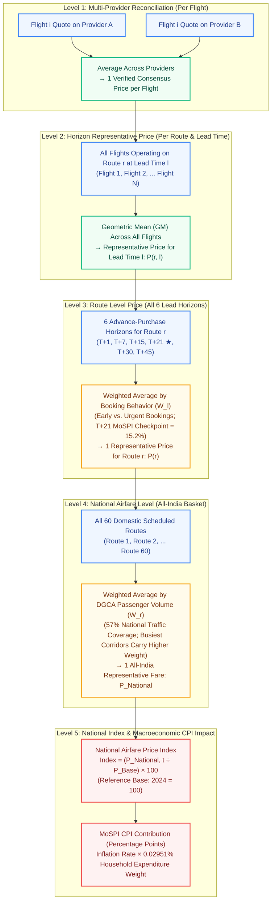

# PPT Guide: How the Airfare Price Index is Calculated

This document provides a clean, evaluator-friendly explanation and generalized visual flowchart designed specifically for slide presentations (PPT). It uses abstract, standard terminology (Routes, Lead Times, Providers, Flights) instead of single examples, while keeping the logic intuitive and mathematically sound.

---

## 1. Generalized Slide Flowchart: "From Scraped Quotes to National Airfare Index"

---

## 2. The 5 Generalized Steps Explained Simply (For Evaluators)

### Step 1: Same Flight across Different Providers
- **The Problem:** The same physical flight (e.g., Airline X, Flight Y) may show slightly different prices across booking platforms (OTAs, airline direct APIs) due to convenience fees or markups.
- **The Fix:** Take the **average across providers**.
- **Result:** Each scheduled flight receives **one clean, consensus market fare**.

### Step 2: Multiple Flights in a Specific Lead-Time Horizon
- **The Problem:** On any given route and booking window (e.g., Route $r$ booked $l$ days ahead), there are multiple flights operating across different times of the day.
- **The Fix:** Calculate the **Geometric Mean (GM)** across all flights in that horizon.
- **Result:** **One representative price $P(r, l)$** for that specific lead-time window without upward skew from high-end outlier tickets.

### Step 3: Combining All 6 Booking Lead-Time Horizons
- **The Problem:** Urgent last-minute bookings (T+1) are expensive, while advance bookings (T+45) are cheaper. Fares naturally change as departure approaches.
- **The Fix:** Take a **weighted average** across all 6 horizons using empirical booking behavior weights ($W_l$):
  - **T+1**: $5.09\%$ (Urgent / last-minute travel)
  - **T+7**: $13.72\%$ (Short advance window)
  - **T+15**: $15.00\%$ (Mid advance window)
  - **T+21**: **$15.19\%$ (Official MoSPI CPI domestic checkpoint)**
  - **T+30**: $24.80\%$ (Standard leisure advance)
  - **T+45**: $26.20\%$ (Early planning)
- **Result:** **One representative price $P(r)$ for the route**.

### Step 4: Combining All Routes Across India
- **The Problem:** High-density trunk corridors carry millions of flyers, while smaller regional sectors carry fewer. Equal weighting would distort the national picture.
- **The Fix:** Take a **weighted average** of all 60 routes using official **DGCA CY2024 Passenger Traffic Shares** ($W_r$).
  - Captures **91.99M passengers** ($57.02\%$ of all Indian domestic air travel).
  - Stations in dual-airport cities (e.g., Goa Dabolim vs. Goa Mopa) are maintained separately.
- **Result:** **One All-India Representative Airfare Price $P_{\text{National}}$**.

### Step 5: Index Compilation & CPI Integration
- **Index Relative:**
  $$\text{Index}_t = \left(\frac{P_{\text{National}, t}}{P_{\text{Base}}}\right) \times 100 \quad (\text{Base } 2024 = 100)$$
- **Macroeconomic CPI Contribution:**
  $$\Delta \text{CPI}_{\text{pp}} = \text{Airfare Inflation Rate (\%)} \times 0.0002951$$
  *(Airfare represents 0.02951% of total Indian household consumption per MoSPI CPI 2024 Annexure 5.3d).*

---

## 3. Evaluator Q&A Cheat Sheet (Talking Points)

- **Q: Why use Geometric Mean (GM) instead of a simple average across flights?**
  - *Answer:* Simple arithmetic averages get distorted if a few premium tickets spike. Geometric Mean gives the true central tendency of the consumer market and eliminates upward bounce (aligned with Eurostat HICP and MoSPI standards).
- **Q: Why track 6 lead times, and why is T+21 special?**
  - *Answer:* Airline dynamic pricing varies heavily by advance purchase. MoSPI's upcoming CPI 2024 explicitly specifies **21 days advance booking** as the national domestic reference checkpoint. Tracking T+1 through T+45 captures the complete yield curve while keeping T+21 strictly isolated.
- **Q: Where do the route weights come from?**
  - *Answer:* Official DGCA CY2024 city-pair passenger statistics. Routes carrying more domestic passengers naturally have a higher weight in the national index.
